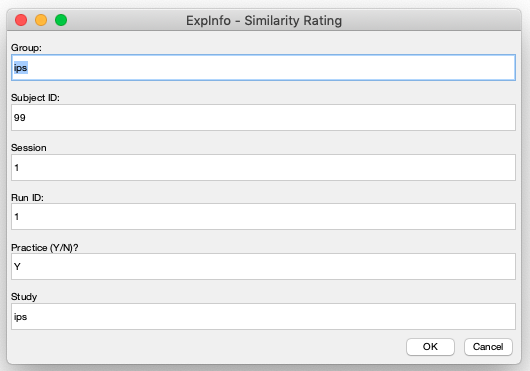

# Perception-Based Face Similarity Rating Task


## Overview

Participants are presented with pairs of faces and are asked to rate the visual similarity between them using a 7-point scale (1 means very different and 7 means very similar). 

The stimuli consist of 57 face images, leading to a total of 1,596 pairs of faces. Each face pair is presented once in a random order and is divided equally over 14 blocks. 

The pairwise similarity ratings will be used as input for perception-based image reconstruction. 

If you are using this task, please cite our work:
* Chang, C.-H., Nemrodov, D., Drobotenko, N., Sorkhou, M., Nestor, A., & Lee, A. C. H. (2021). Image reconstruction reveals the impact of aging on face perception. *Journal of Experimental Psychology: Human Perception and Performance, 47*(7), 977–991. https://doi.org/10.1037/xhp0000920

See the article above for more details of the task.


## System Requirements

### Operating system

* This task should work on Microsoft Windows, MacOS and Linux. However, it has only been tested on Windows 10 and MacOS 10.14 (Mojave; intel chip)

### Software 

* 64-bit version Matlab (the task has been tested on Matlab 2019a)

* [Psychtoolbox](http://psychtoolbox.org/) (the task has been tested on Psychtoolbox 3.14)


## How to Run the Task

### Preparation

* Put the stimuli (57 face images) in the `stims` folder and run the `create_imgMat.m` script to create a mat file (e.g., `ims_new.mat`) that stores all face images.

    * Due to copyright restriction, face images and the mat file are not provided here. 

* To create all pairs of faces and randomize trial order in advance for a given participant, type the following codes in the Matlab Command Window

```Matlab
subID = 'ips99'; % subject's ID (including group label and number)
studyID = 'ips'; % the ID of the study
% You can change subID and/or studyID

% Generate pairs of faces and randomize trial order for a given participant.
tpOrder(subID, studyID) 
% the mat file is stored in the folder order_tp_xxx, depending on the studyID you enter

% You can also create a for loop to generate trial order files for multiple participants. 
```

### Run the face similarity rating task

* To run the face similarity rating task, type the `FaceSimPercep` in the Matlab Command Window
    
    * If you want to run the task in debugging mode (i.e., the background will be transparent rather than black, which allows you to see Matlab messages/errors during the task), open the `FaceSimPercep.m` script and change the variable `debugMode` (line 20) from 0 to 1.

* A Matlab dialog box will appear (see the attached screenshot below) and you can enter information of the study, participant, current session, and determine whether or not including a practice block.   
    
    

### Restuls

* The results of each participant are stored in the folder `results_ips` (*"ips"* is the study ID you enter in the dialog box)